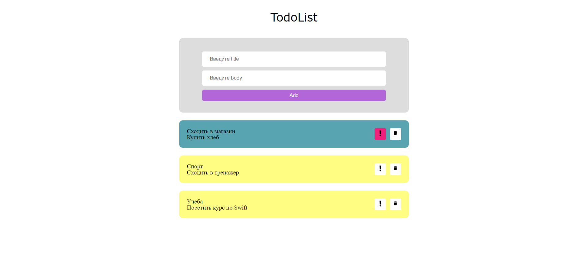

# TodoList

Это простой проект TodoList, реализованный с использованием HTML, CSS и JavaScript.

## Особенности

- Добавление новых задач.
- Пометка задач как важных.
- Удаление задач.

## Предварительный просмотр

[](https://erezhep.github.io/ToDo-List/)

## Установка

1. Клонируйте репозиторий:
   ```bash
   git clone https://github.com/Erezhep/ToDo-List.git
   ```
2. Откройте файл `index.html` в вашем веб-браузере.

## Использование

- Введите заголовок и описание для вашей задачи.
- Нажмите кнопку "Добавить", чтобы добавить задачу в список.
- Нажмите на кнопку со восклицательным знаком, чтобы отметить задачу как важную.
- Нажмите на кнопку со значком корзины, чтобы удалить задачу.